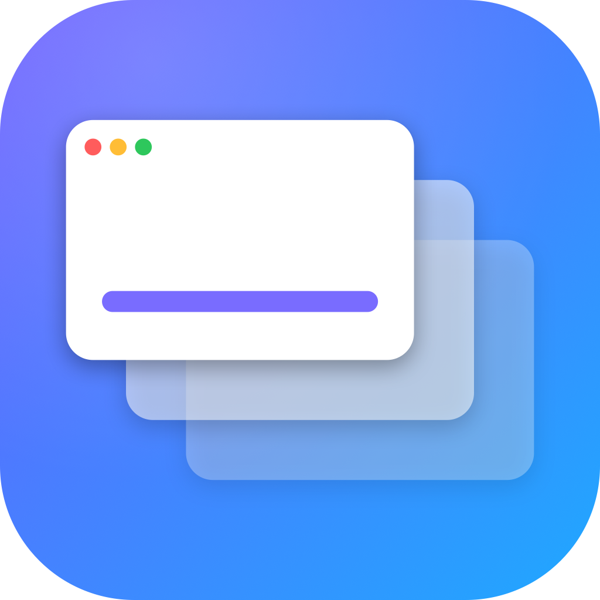

<p align="center">
  
</p>

# mwitch

mwitch is a fast macOS window switcher for Apple Silicon Macs. It makes
`Cmd+Tab` switch between individual windows instead of app icons, so the exact
window you want is one keystroke away.

## Install

### Homebrew

```sh
brew tap viraatdas/mwitch https://github.com/viraatdas/mwitch
brew install --cask mwitch
```

### Direct Download

Download the latest signed and notarized release:

```sh
open https://github.com/viraatdas/mwitch/releases/latest/download/mwitch.zip
```

Unzip it, then drag `mwitch.app` into `/Applications`.

## First Launch

1. Open `mwitch.app` from Applications.
2. Grant Accessibility permission when macOS asks.
3. Grant Screen Recording permission when macOS asks. macOS requires this for apps that read window titles.
4. When macOS asks to quit and reopen mwitch, allow it.
5. Press `Cmd+Tab`.

If a permission prompt disappeared, open System Settings manually:

- Privacy & Security > Accessibility > enable mwitch
- Privacy & Security > Screen Recording > enable mwitch

If mwitch is already enabled but does not work, remove it from the permission list, add `/Applications/mwitch.app` again, then relaunch mwitch.

## How To Use

- `Cmd+Tab`: open the switcher
- `Cmd+Tab` again while holding Cmd: advance
- `Cmd+Shift+Tab`: go backward
- Up or Down: move selection
- Type: filter by app name or window title
- Enter or release Cmd: switch to the selected window
- Esc: dismiss
- Click a row: switch immediately

## Updates

mwitch updates automatically with Sparkle. You can also choose `Check for Updates...` from the menu bar icon.

Homebrew users can also run:

```sh
brew update
brew upgrade --cask mwitch
```

## Requirements

- Apple Silicon Mac
- macOS 13 Ventura or later

## Privacy

mwitch has no telemetry, no accounts, and no network service beyond update checks. Accessibility is used to raise the window you pick. Screen Recording permission is used only because macOS requires it to read other apps' window titles.

## Source

Source code and releases are available at https://github.com/viraatdas/mwitch.
